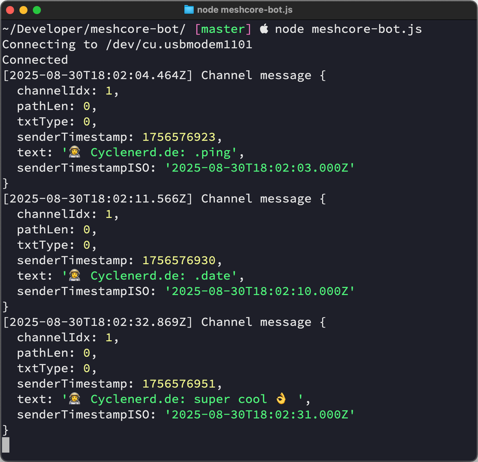

# 🤖 MeshCore Bot

This script is a command bot that connects to a [MeshCore](https://github.com/meshcore-dev/MeshCore) companion radio device via USB serial connection and responds to commands received in private channels.

> [!IMPORTANT]
> To prevent spam in public channels, this bot only responds in private channels!

The bot is also able to fetch and log telemetry sensor (currently only voltage) data from a repeater node.
The telemetry data is logged to a CSV file.
The interval at which the telemetry data is fetched can be configured.
This bot is ideal for testing MeshCore setup with repeater and distance of communication.

| Client | Bot |
|--------|-----|
|  |  |

## Installation

1.  **Node.js**: Make sure you have Node.js installed. You can download it from [https://nodejs.org/](https://nodejs.org/) or install it on macOS with [Homebrew](https://brew.sh/) package manager:

    ```bash
    brew install node
    ```

1.  **Clone**: Clone this repo:

    ```bash
    git clone "https://github.com/Cyclenerd/meshcore-bot.git"
    cd "meshcore-bot"
    ```

1.  **Dependencies**: In the directory run:

    ```bash
    npm ci --production
    ```

## Usage

To run the bot use the following command:

```bash
node meshcore-bot.js --port [SERIAL_PORT] --repeater-public-key-prefix [REPEATER_PUBLIC_KEY_PREFIX] --repeater-password [REPEATER_PASSWORD] --telemetry-interval [TELEMETRY_INTERVAL_MINUTES] --csv [CSV_FILE]
```

-   `--port` or `-s` (optional): The serial port of the MeshCore device. Defaults to `/dev/cu.usbmodem1101`.
-   `--repeater-public-key-prefix` or `-r` (optional): The public key prefix of a repeater node to fetch telemetry from. If provided, the telemetry feature is enabled.
-   `--repeater-password` or `-p` (optional): The password for the repeater. By default, this is an empty string.
-   `--telemetry-interval` or `-t` (optional): The interval in minutes at which telemetry data is retrieved from the repeater. The default value is `15`.
-   `--csv` or `-c` (optional): The CSV file in which the repeater's telemetry data is to be logged. If this file is specified, the telemetry data will be logged in this file.

### Examples

**Basic:**
```bash
node meshcore-bot.js --port "/dev/ttyUSB0"
```

**With Repeater Telemetry:**
```bash
node meshcore-bot.js --port "/dev/ttyUSB0" --repeater-public-key-prefix "935c6b694200644710a374c250c76f7aed9ec2ff3e60261447d4eda7c246ce5d" --repeater-password "your-password" --telemetry-interval 5
```
This will connect to the device on `/dev/ttyUSB0` and fetch telemetry from the specified repeater every 5 minutes.

**With Repeater Telemetry and CSV Logging:**
```bash
node meshcore-bot.js --port "/dev/ttyUSB0" --repeater-public-key-prefix "935c6b694200644710a374c250c76f7aed9ec2ff3e60261447d4eda7c246ce5d" --repeater-password "your-password" --telemetry-interval 5 --csv "telemetry.csv"
```
This will do the same as the previous example, but it will also log the telemetry data to `telemetry.csv`.

### Commands

-   `.ping`: The bot will respond with "PONG! 🏓 (*hop count*)".
-   `.date`: The bot will respond with the current date and time in ISO format.

## License

All files in this repository are under the [Apache License, Version 2.0](LICENSE) unless noted otherwise.
